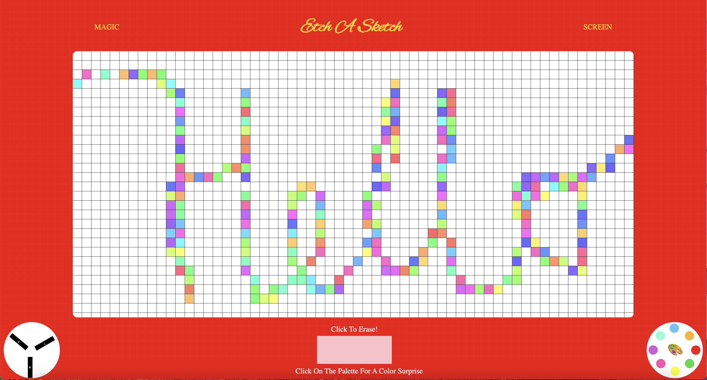

# etch-a-sketch

Draw like there's no tomorrow! This project was created to further practice DOM manipulation and create a website with moblie support. 
I'm glad I got the opportunity to experience how js can be used to alter CSS attributes. 
This is the fourth project of TOP. 

# What I Learned 
  * CSS Grid for building the rows and columns 
  * Created a toggle function for animation and only added the animation to the CSS when the button is clicked
  * Used media queries in CSS to make the website responsive for various viewport sizes
  * Target each div using "this" keyword 
  * Change CSS attributes in js based on the conditional statements 

# Preview 

# Demo 
🕹 [Etch - A - Sketch](https://bubblegumloco.github.io/etch-a-sketch/)
